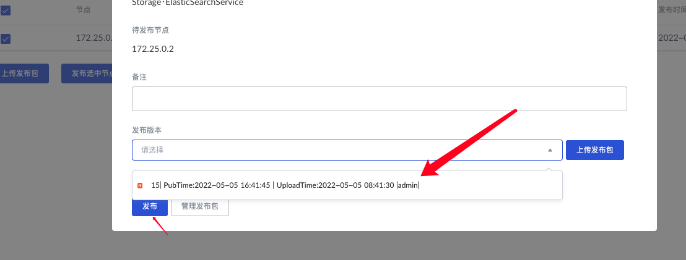

# Go整合ElasticSearch

### &#x20;安装ES并运行

```
docker pull elasticsearch:7.2.0 // 这里版本号如果不填写的化默认pull lasted的
// 运行es
docker run -d \
--name es \
-p 9200:9200 -p 9300:9300 \
-e "discovery.type=single-node" -e ES_JAVA_OPTS="-Xms200m -Xmx200m" \
elasticsearch:7.2.0
```

执行上述命令后，docker会去拉取es，并安装。



出现如下界面代表已经完成了安装。

.png>)

我们检查一下docker运行状态，可以看到运行已经正常。

.png>)

### 安装kibana

从docker安装kibana，当然动手能力强的小伙子可以使用源码包，我这里出于方便管理考虑，所以统一采用了docker来进行管理。

```
 docker pull elastic/kibana:7.2.0
```

如果出现找不到包的情况，也不要慌，我们可以通过docker search + 包名来进行搜索，一般会找到我们需要的包的。

下载完成之后，我们通过下面的操作对es进行绑定。

```shell
docker run --name kibana -e ELASTICSEARCH_URL=http://127.0.0.1:9200 -p 5601:5601 -d elastic/kibana:7.2.0
```

.png>)

.png>)

对了记得设置es密码

进入容器使用elasticsearch-setup-passwords interactive 设置

运行完成，打开浏览器检查是否成功

打开 http://ip:5601，登陆成功。

.png>)


### 安装go依赖

此处，我们操作es选择了olivere所提供的库，虽然官方也提供了go-elasticsearch，不过就操作的便捷性来说，olivere封装程度更高，更适合大家的使用（亲测体验）。

同样olivere（[https://github.com/olivere/elastic](https://github.com/olivere/elastic)）提供了很多版本的es库，我们需要根据我们所安装的es版本进行选择，附上相关版本表格。

.png>)

我这里上面所安装的是7.2的所以我直接就安装v7的依赖。

```shell
go get github.com/olivere/elastic/v7
```

.png>)

安装完成，导入模块，测试连接。

```go
package common

import (
	"fmt"
	"github.com/olivere/elastic/v7"
	"time"
)

var client elastic.Client

func init() {
	client, err := elastic.NewClient(
		elastic.SetSniff(false), // 禁止嗅探
		elastic.SetURL("http://ip:9200"),
		elastic.SetGzip(true),
		elastic.SetHealthcheckInterval(10*time.Second),
	)
	if err != nil {
		fmt.Printf("连接失败: %v\n", err)
	} else {
		fmt.Println("连接成功")
	}
	fmt.Println(client)
}
```

运行上述代码出现如下所示，代表完成es的连接，接下来就可以进行快乐的curd了。

.png>)

### 创建索引

执行代码创建索引，我这里就是创建一个Article文件的对象。

```go
package model

import (
	"context"
	"es-demo/common"
	"fmt"
	"time"
)

type Article struct {
	Title   string    `json:"title"`
	Content string    `json:"content"`
	Author  string    `json:"author"`
	Create  time.Time `json:"create"`
}

var client = common.GetClient()

func CreateIndex() {
	article := Article{
		Title:   "测试标题",
		Content: "标题正文",
		Author:  "测试",
		Create:  time.Now(),
	}
	do, err := client.
		Index().
		Index("es.demo.article").
		BodyJson(article).
		Do(context.Background())
	if err != nil {
		return
	}
	fmt.Printf("文档Id %s, 索引名 %s\n", do.Id, do.Index)
}
```

执行完成，我们去kibana上看看是否写入成功，很明显查询成功，已经成功写入。

.png>)

### 查询索引

查询所有，查询我们刚刚插入的数据。

```go
func Query() {
	boolQuery := elastic.NewBoolQuery()
	termQuery := elastic.NewTermQuery("title.keyword", "测试标题")
	boolQuery.Must(termQuery)
	do, err := client.
		Search("es.demo.article").
		Query(boolQuery).
		Do(context.Background())
	if err != nil {
		log.Fatalf("发生异常 %s\n", err.Error())
	}
	if len(do.Hits.Hits) == 0 {
		log.Println("暂无结果！")
		return
	}
	articleArray := make([]*Article, 0)
	for _, e := range do.Each(reflect.TypeOf(&Article{})) {
		us := e.(*Article)
		articleArray = append(articleArray, us)
	}
	log.Printf("查询成功！%s\n", articleArray)
}
```

### 修改

修改标题为，测试标题1。

```go
func Update() {
	doc := map[string]interface{}{
		"title": "新的文章标题"}
	id, docType := Query()
	do, err := client.
		Update().
		Index("es.demo.article").
		Doc(doc).
		Type(docType).
		Id(id).
		Do(context.Background())
	if err != nil {
		log.Println("更新完成！")
		return
	}
	log.Printf("更新成功 docId为 %s", do.Id)
	return
}

```

查询变更结果，可以看出变更成功。

.png>)

### 删除

传入ID和Type删除对应的数据，具体代码如下所示。

```go
func Delete() {
	id, docType := Query()
	do, err := client.
		Delete().
		Index("es.demo.article").
		Type(docType).
		Id(id).
		Do(context.Background())
	if err != nil {
		log.Printf("删除失败 %s！", do.Id)
		return
	}
	log.Printf("删除成功 %s！", do.Id)
}

```

查询删除结果，可以看到删除成功。

.png>)

到此为止简单的ES整合已经完成。
